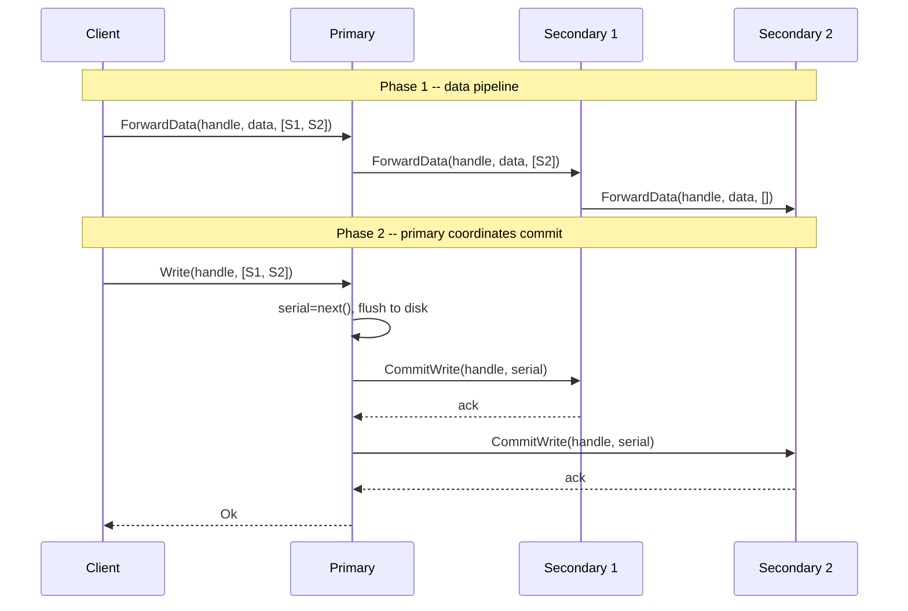
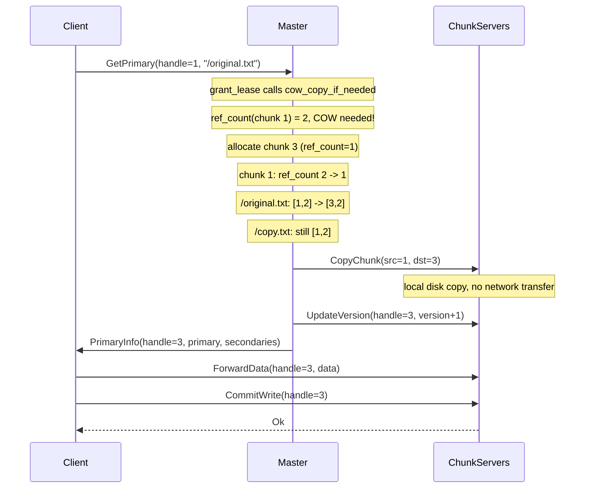
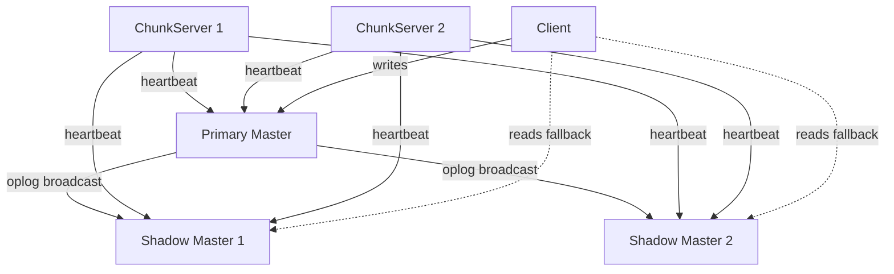
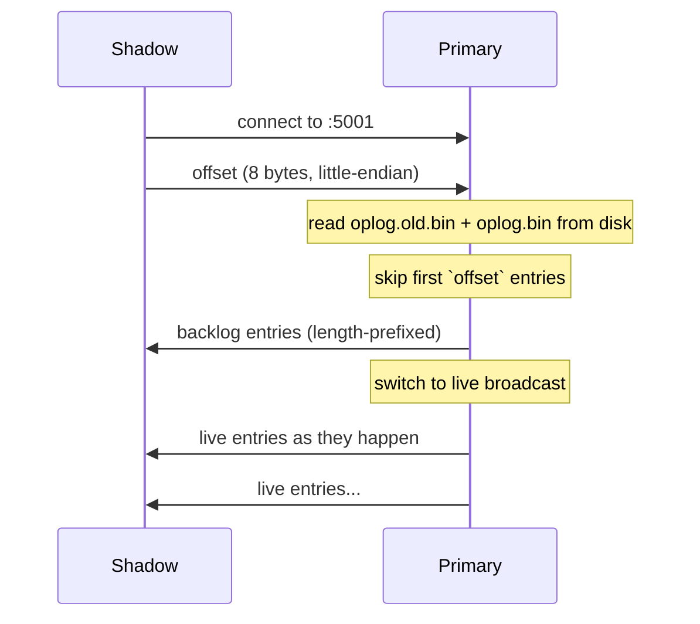
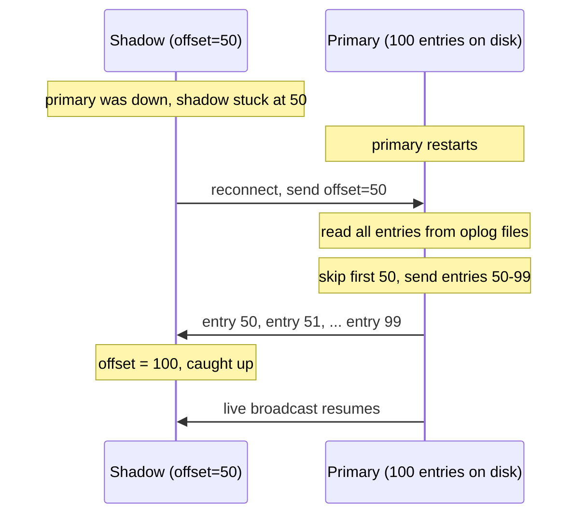
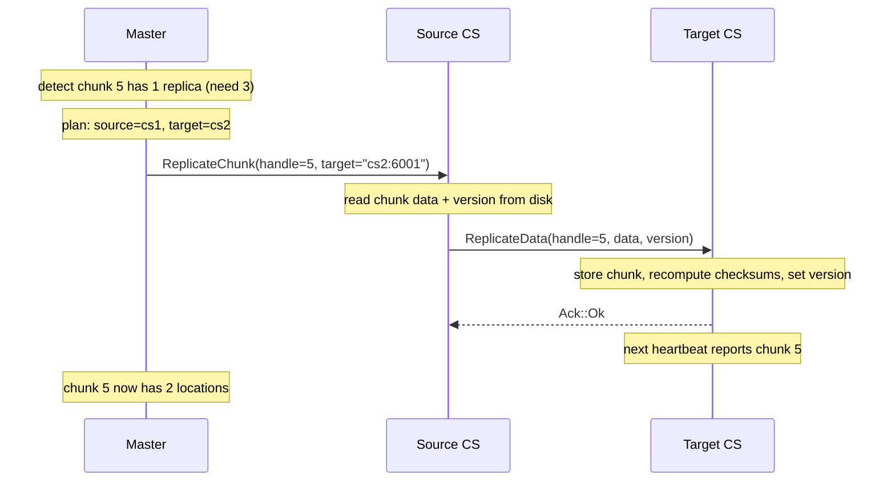
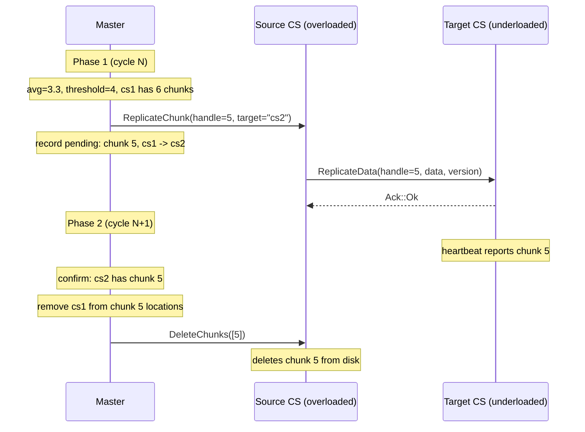
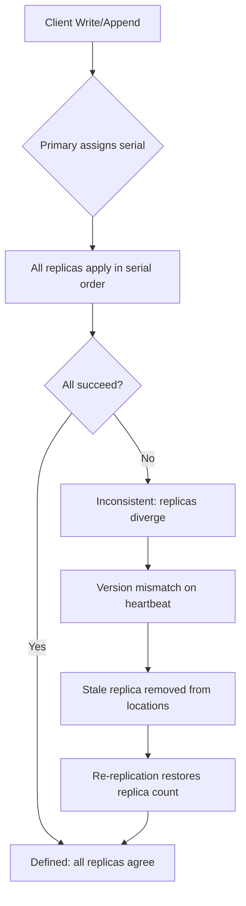

# juzfs

A complete implementation of the [Google File System](https://static.googleusercontent.com/media/research.google.com/en//archive/gfs-sosp2003.pdf) in Rust. Raw TCP, no frameworks, no shortcuts. Built in 5 days on almost no sleep because once you start implementing a distributed file system, you can't really stop.

For a detailed breakdown of the GFS architecture, see [The Google File System: A Detailed Breakdown](https://www.pixperk.tech/blog/the-google-file-system-a-detailed-breakdown).

## Why GFS

GFS was built around assumptions that most filesystems ignore: files are huge, reads are sequential, writes are almost always appends, and disks fail constantly. Rather than fighting these realities with a general-purpose POSIX layer, Google designed around them. One master, big chunks, relaxed consistency for appends. juzfs takes this same approach and implements it in Rust with async I/O.

## Architecture


Three components, all talking raw TCP:

### Master

The single metadata server. Holds the file namespace (filenames to chunk handle lists), chunk metadata (version, primary lease, replica locations), and the state of every registered chunkserver. Everything lives in memory behind `RwLock`s. The master never sees file data -- clients ask it "where does this chunk live?", get an answer, and go talk to chunkservers directly. Keeping the master off the data path is the core scalability trick in GFS.

Chunk locations are deliberately not persisted. On restart, the master knows nothing about which chunkserver holds what. As chunkservers boot and heartbeat in, they report their full chunk inventory with version numbers. The master rebuilds its location map from these reports. This is more robust than persisting locations because the chunkservers are always the ground truth about what's physically on their disks.

All metadata mutations (file creation, chunk allocation, lease grants) are logged to an append-only operation log before being applied to memory. The master recovers from this log on startup, and periodically snapshots its state to a checkpoint file for faster recovery. More on this in the [Operation Log](#operation-log) and [Checkpointing](#checkpointing) sections.

### Chunkservers

The data layer. Each chunkserver manages a local directory with three types of files per chunk:

```
chunks/00000001.chunk    -- raw data, up to 64MB
checksums/00000001.csum  -- CRC32 per 64KB block, packed big-endian
versions/00000001.ver    -- chunk version number
```

Chunks default to 64MB (configurable via CLI for testing). Every 64KB block gets a CRC32 checksum computed on write and verified on every read. A mismatch means corruption, and the read fails so the client can try another replica.

For writes, chunkservers maintain an LRU push buffer (32 entries). Data arrives in phase 1 of the write protocol and sits in memory until the primary triggers a commit in phase 2. A monotonic `AtomicU64` serial counter on the primary ensures all replicas apply mutations in identical order.

Every 5 seconds, each chunkserver heartbeats to the master with its chunk list (handles + versions) and real available disk space (calculated from actual file sizes, not hardcoded).

### Client

A Rust library (`src/client.rs`) that handles all the protocol complexity. It caches chunk metadata locally with a 30-second staleness window to avoid redundant master lookups. The client manages the full read, write, and append flows, including transparent retry when a chunk fills up during record append.

## Protocol

Custom TCP framing with magic bytes and length-prefixed payloads:

```
[magic: 2B "JF"][version: 1B][msg_type: 1B][payload_len: 4B][payload]
```

The framing code is compact. Here's the core of `send_frame`:

```rust
const MAGIC: [u8; 2] = [0x4A, 0x46]; // 'J' 'F'
const VERSION: u8 = 1;

pub async fn send_frame<T: Serialize>(
    stream: &mut TcpStream, msg_type: MessageType, payload: &T,
) -> io::Result<()> {
    let body = bincode::serialize(payload)
        .map_err(|e| io::Error::new(io::ErrorKind::InvalidData, e))?;
    let mut header = [0u8; 8];
    header[0..2].copy_from_slice(&MAGIC);
    header[2] = VERSION;
    header[3] = msg_type as u8;
    header[4..8].copy_from_slice(&(body.len() as u32).to_le_bytes());
    stream.write_all(&header).await?;
    stream.write_all(&body).await?;
    Ok(())
}
```

Magic bytes `0x4A 0x46` catch misframed connections immediately. The `msg_type` byte routes messages:

| msg_type | Direction |
|----------|-----------|
| 1 | Client to Master |
| 2 | Master to Client |
| 3 | ChunkServer to Master |
| 4 | Master to ChunkServer |
| 5 | Client to ChunkServer |
| 6 | ChunkServer to Client |
| 7 | ChunkServer to ChunkServer |
| 8 | ChunkServer Ack |

Payloads are bincode v1. Each direction has its own serde enum, so extending the protocol is just adding a variant.

## Reads

The master is never on the read path. The client asks it for metadata once, then reads directly from chunkservers.

1. `GetFileChunks` returns the ordered list of chunk handles for a file
2. `GetChunkLocations` returns which chunkservers hold each chunk
3. Client sends `Read { handle, offset, length }` directly to a chunkserver
4. If that replica fails (network error, checksum mismatch), try the next one

For multi-chunk reads, the client calculates which chunks the byte range spans and issues per-chunk reads with the correct local offsets. If the requested length exceeds what the chunk actually has, the chunkserver clamps it and returns what's available.

**Streaming reads** pipe chunks through a tokio mpsc channel with a 4-chunk lookahead buffer. A background task fetches chunks in order and feeds them into the channel. The consumer processes data as it arrives without loading the entire file into memory.

## Writes

Writes separate data flow from control flow using a two-phase protocol. This is the most interesting part of the design.




**Phase 1** pushes data through a chunkserver chain. The client sends to the first node, which buffers and forwards to the next, and so on. Data flows in a single network pass rather than the client uploading to each replica separately. All nodes buffer in memory (the LRU push buffer), nothing touches disk yet. If any node in the chain fails to forward, the error propagates back through the entire chain to the client via `ChunkServerAck::Error`:

```rust
// chunkserver buffers data, then forwards to next in chain
cs.buffer_push(handle, data.clone()).await;

let mut chain_err: Option<String> = None;
if let Some((next, rest)) = remaining.split_first() {
    let fwd = ChunkServerToChunkServer::ForwardData {
        handle, data, remaining: rest.to_vec(),
    };
    match TcpStream::connect(next).await {
        Ok(mut next_conn) => {
            // send and read downstream ack...
        }
        Err(e) => {
            chain_err = Some(format!("forward to {} unreachable: {}", next, e));
        }
    }
}
match chain_err {
    Some(e) => ChunkServerAck::Error(e),
    None => ChunkServerAck::Ok,
}
```

**Phase 2** is where ordering happens. The client tells the primary to commit. The primary assigns a monotonic serial number, flushes its own buffer to disk, then sends `CommitWrite` to each secondary with that serial. Secondaries flush and ack. Only after all replicas confirm does the primary ack the client.

The serial number is the consistency mechanism. Two concurrent writes to the same chunk get serialized by the primary. Every replica applies them in serial order, so they converge to identical state.

### Leases

Before any write, the client asks the master for a primary via `GetPrimary`. The master grants a 60-second lease to one chunkserver. The same lease is reused for all writes during that window. No round-trip to the master per write, just per lease period.

When a lease expires and a new one is needed, the master bumps the chunk version, notifies all replicas via `UpdateVersion`, and returns the new primary. This version bump is how stale replicas get caught (more on that below).

## Record Append

The dominant write pattern in GFS. The client provides only data, no offset. The primary decides where to place it. Multiple clients can append concurrently to the same file without any coordination between them.


The flow:

1. Client finds the last chunk of the file and sends `Append { handle, data, secondaries }` to its primary
2. Primary checks: does `current_size + data_len` fit within the chunk size?
3. **Fits**: primary sets `offset = current_size`, appends locally, sends `CommitAppend` with the same offset and data to all secondaries. Returns `AppendOk { offset }` to the client.
4. **Doesn't fit**: primary pads the chunk to exactly 64MB on all replicas and returns `RetryNewChunk`. The client allocates a new chunk via the master, invalidates its metadata cache, and retries. This loop is transparent to the caller.

The padding matters. Without it, a half-full chunk on one replica could accept a conflicting append from a different client, breaking cross-replica consistency. Padding seals the chunk on all replicas simultaneously.

## Chunk Versioning

Every chunk starts at version 0. The version increments each time the master grants a new lease for that chunk. This is how the system detects replicas that missed mutations while they were down.

The version lives in three places:
- **Master memory**: `ChunkInfo.version`, the authoritative value
- **Chunkserver disk**: `.ver` file per chunk, survives restarts
- **Chunkserver memory**: `HashMap<ChunkHandle, u64>`, loaded from disk on init

When the master grants a lease and bumps the version, it connects to every replica and sends `UpdateVersion { handle, version }`. Each chunkserver persists the new version to its `.ver` file and inserts into its in-memory map. The insert-not-update matters -- `UpdateVersion` can arrive before the chunk data does (the version bump happens at lease grant time, data arrives later during the write). If the chunkserver only updated existing entries, the version would be lost and the subsequent `store_chunk` would default to version 0:

```rust
// update_version must always insert, not just update existing entries.
// UpdateVersion arrives at lease grant time, before any data is written.
// If we only did get_mut here, the version would be lost when store_chunk
// later inserts the handle with version 0.
pub async fn update_version(&self, handle: ChunkHandle, version: u64) -> io::Result<()> {
    self.write_version_to_disk(handle, version)?;
    let mut stored = self.stored_chunks.write().await;
    stored.insert(handle, version);  // insert, not get_mut
    Ok(())
}
```

On heartbeat, each chunkserver reports `(handle, version)` pairs. The master compares:
- **Version matches or ahead**: healthy replica, stays in the location list
- **Version behind**: stale replica, removed from locations

Once removed, the stale chunkserver is invisible to clients. No reads or writes will be directed to it. This happens automatically, no manual intervention.

## Operation Log


The operation log (oplog) is how the master survives crashes. Every metadata mutation is written to an append-only log on disk before it is applied to memory. If the master crashes, it replays the log on startup and reconstructs its state.

The oplog records five types of mutations:

```rust
pub enum OpLogEntry {
    CreateFile { filename: String },
    AddChunk { filename: String, handle: ChunkHandle },
    GrantLease { handle: ChunkHandle, primary: String, version: u64 },
    DeleteFile { filename: String, hidden_name: String, timestamp: u64 },
    Snapshot { src: String, dst: String },
}
```

Each entry is length-prefixed and bincode-serialized. The critical invariant: **the log is flushed to disk before the mutation becomes visible to clients**. If a client got an OK response, that operation survived the crash. If the master crashed before flushing, the client got no response and will retry.

```rust
// in create_file: log BEFORE applying to memory
pub async fn create_file(&self, filename: String) -> io::Result<()> {
    let mut oplog = self.oplog.lock().await;
    oplog.log(&OpLogEntry::CreateFile { filename: filename.clone() })?;
    drop(oplog);

    let mut files = self.files.write().await;
    files.insert(filename, Vec::new());
    // ...
}
```

What the oplog does NOT store:
- **Chunk locations**: rebuilt from chunkserver heartbeats on startup
- **Leases**: expired after a crash anyway, chunkservers will request new ones
- **Chunkserver registrations**: transient state, rebuilt as chunkservers reconnect

On recovery, the master loads the latest checkpoint (if any), then replays the oplog entries on top. Chunkserver heartbeats fill in the locations, and the system is back online.

## Checkpointing

Replaying the entire oplog from the beginning of time gets slow as the system grows. Checkpointing solves this by periodically snapshotting the master's in-memory state to disk, following the GFS paper's approach.

The checkpoint captures the minimum state needed to restore the master:

```rust
pub struct Checkpoint {
    pub files: HashMap<String, Vec<ChunkHandle>>,
    pub chunks: HashMap<ChunkHandle, u64>,  // handle -> version
    pub next_chunk_handle: ChunkHandle,
    pub deleted_files: HashMap<String, (String, u64)>,  // hidden_name -> (original, timestamp)
}
```

The checkpointing flow follows the GFS design -- log rotation first, then background write:

1. **Rotate** the oplog: rename `oplog.bin` to `oplog.old.bin`, open a fresh `oplog.bin`. This is fast (just a rename + open) and happens under the oplog lock. New mutations immediately flow to the fresh log with zero blocking.
2. **Snapshot** the current state: read `files`, `chunks`, and `next_chunk_handle`. These are read locks, so mutations can proceed concurrently.
3. **Write checkpoint in the background**: serialize to `checkpoint.bin.tmp`, then atomically rename to `checkpoint.bin`. The tmp+rename ensures that an incomplete write is never visible. Once the checkpoint is written, delete `oplog.old.bin`.

```rust
pub async fn maybe_checkpoint(&self) -> io::Result<()> {
    let mut oplog = self.oplog.lock().await;
    if oplog.count() < CHECKPOINT_THRESHOLD { return Ok(()); }

    // step 1: rotate (fast, under lock)
    oplog.rotate(Path::new(&self.oplog_path))?;
    drop(oplog); // new mutations proceed immediately

    // step 2: snapshot state (read locks only)
    let files = self.files.read().await.clone();
    let chunks_map = /* ... */;
    let cp = Checkpoint { files, chunks: chunks_map, next_chunk_handle };

    // step 3: write in background
    tokio::task::spawn_blocking(move || {
        write_checkpoint(Path::new(&checkpoint_path), &cp)?;
        std::fs::remove_file(old_oplog_path).ok();
    });
    Ok(())
}
```

If the master crashes between rotate and checkpoint completion:
- `checkpoint.bin` is either missing or incomplete (detected and skipped)
- `oplog.old.bin` still exists with all pre-rotation entries
- `oplog.bin` has post-rotation entries
- Recovery replays `oplog.old.bin` first, then `oplog.bin`, and reconstructs everything

This is the same resilience property described in the GFS paper: "if checkpointing fails midway, the new log still contains all mutations, and incomplete checkpoints are detected and skipped."

The checkpoint triggers after every 100 oplog entries (configurable via `CHECKPOINT_THRESHOLD`). Recovery on startup:

1. Load `checkpoint.bin` if it exists
2. Replay `oplog.old.bin` if it exists (crash between rotate and checkpoint)
3. Replay `oplog.bin` (entries written after the last checkpoint)
4. Wait for chunkserver heartbeats to repopulate locations

## Garbage Collection


GFS doesn't immediately free storage when a file is deleted. Instead, it uses a lazy, three-phase approach that is simpler and more reliable than eager deletion.

### Step 1: Lazy Deletion

When a client deletes a file, the master doesn't remove anything. It renames the file to a hidden name with a deletion timestamp and logs the operation:

```rust
pub async fn delete_file(&self, filename: String) -> io::Result<bool> {
    // rename /foo.txt -> /.deleted_foo.txt
    let hidden = format!("/.deleted_{}", filename.trim_start_matches('/'));
    let now = SystemTime::now().duration_since(UNIX_EPOCH).unwrap().as_secs();

    // log before mutating
    oplog.log(&OpLogEntry::DeleteFile {
        filename: filename.clone(),
        hidden_name: hidden.clone(),
    })?;

    // move chunks from original name to hidden name
    if let Some(handles) = files.remove(&filename) {
        files.insert(hidden.clone(), handles);
    }
    deleted_files.insert(hidden, (filename, now));
    Ok(true)
}
```

The file is invisible to clients immediately, but its chunks still exist on disk. This gives a recovery window -- if the delete was accidental, the hidden file could be undeleted before the next GC pass.

### Step 2: Background Sweep

A background task runs every 60 seconds, scanning the `deleted_files` map for entries past the retention window (5 minutes). Expired entries are reaped: their chunk metadata is removed from the master, and the orphaned chunk handles are collected.

```rust
pub async fn gc_sweep(&self, retention_secs: u64) -> Vec<ChunkHandle> {
    let expired: Vec<_> = deleted.iter()
        .filter(|(_, (_, ts))| now - ts >= retention_secs)
        .collect();

    for (hidden_name, _) in &expired {
        if let Some(handles) = files.remove(hidden_name) {
            for h in handles {
                chunks.remove(&h);
                orphaned_chunks.push(h);
            }
        }
        deleted.remove(hidden_name);
    }
    orphaned_chunks
}
```

### Step 3: Heartbeat-Driven Chunk Cleanup

After the master removes chunk metadata, chunkservers still have the data on disk. On the next heartbeat, when a chunkserver reports a chunk handle the master doesn't recognize, the master replies with `DeleteChunks`:

```rust
// in heartbeat(): master doesn't know this chunk — it's orphaned
if chunk_map.get(handle).is_none() {
    orphaned.push(*handle);
}

// master replies:
MasterToChunkServer::DeleteChunks(orphaned)
```

The chunkserver receives this and deletes the chunk files from disk. No separate protocol, no extra coordination -- the existing heartbeat loop handles everything.

This three-phase design means deletion never blocks the client, orphaned storage is reclaimed automatically, and a crash at any point is safe: the oplog and checkpoint preserve the `deleted_files` state, and the heartbeat cycle will eventually clean up chunkserver storage.

## Copy-on-Write Snapshots

Snapshots are the most intricate piece of the system. A snapshot creates an instant copy of a file with zero data copying. The actual copying is deferred until the first write to a shared chunk, following the GFS paper's copy-on-write approach.

### Why Snapshots Are Hard

A naive snapshot would copy every chunk of a file to new locations. For a 10GB file spread across 160 chunks, that's 30GB of network traffic (3x replication) and minutes of blocking. GFS avoids all of this by observing that most snapshots are never fully modified. If you snapshot a file and only edit the first chunk, why copy the other 159?

### The Mechanism: Reference Counting

Every chunk has a `ref_count`. It starts at 1 when the chunk is created. When a snapshot shares it, the count goes to 2. The ref_count is the only thing the system checks to decide whether a write needs to fork the chunk.

```rust
pub struct ChunkInfo {
    pub handle: ChunkHandle,
    pub version: u64,
    pub primary: Option<String>,
    pub lease_expiry: Option<Instant>,
    pub locations: Vec<String>,
    pub ref_count: u64,  // 1 = normal, >1 = shared by snapshot
}
```

### Phase 1: Creating the Snapshot

When the master receives a snapshot request for `/original.txt` -> `/copy.txt`:

1. **Log to oplog** - `OpLogEntry::Snapshot { src, dst }` is flushed to disk before anything else
2. **Revoke leases** - clear `primary` and `lease_expiry` on every chunk in the source file. This forces the next write to go through `grant_lease`, where the COW check happens
3. **Duplicate metadata** - clone the source file's chunk handle list into the destination. Both files now point to the same physical chunks
4. **Bump ref_counts** - increment `ref_count` on each shared chunk

```rust
pub async fn snapshot(&self, src: String, dst: String) -> io::Result<bool> {
    oplog.log(&OpLogEntry::Snapshot { src: src.clone(), dst: dst.clone() })?;

    let handles = files.get(&src).cloned();
    files.insert(dst, handles.clone());

    for &h in &handles {
        if let Some(info) = chunks.get_mut(&h) {
            info.ref_count += 1;       // 1 -> 2
            info.primary = None;       // revoke lease
            info.lease_expiry = None;
        }
    }
    Ok(true)
}
```

After this, the state looks like:

```
/original.txt -> [chunk 1, chunk 2]
/copy.txt     -> [chunk 1, chunk 2]   (same handles, no data copied)

chunk 1: ref_count = 2, primary = None
chunk 2: ref_count = 2, primary = None
```

This is near-instantaneous regardless of file size. A 10GB file snapshots in microseconds.

### Phase 2: Reading After Snapshot

Reads don't need leases. Both files read from the same chunks, and both return identical data. There is no overhead for reads on snapshotted files.

### Phase 3: First Write After Snapshot (COW)

This is where the complexity lives. When a client writes to `/original.txt`, the system needs to fork the shared chunk so the snapshot isn't corrupted.

The full sequence:



The `cow_copy_if_needed` function is the core:

```rust
async fn cow_copy_if_needed(&self, handle: ChunkHandle, filename: &str)
    -> io::Result<(ChunkHandle, Option<(ChunkHandle, Vec<String>)>)>
{
    let info = chunks.get(&handle);
    if info.ref_count <= 1 {
        return Ok((handle, None));  // not shared, no COW
    }

    let new_handle = allocate_handle();

    // clone metadata, ref_count = 1
    chunks.insert(new_handle, ChunkInfo {
        handle: new_handle,
        version: info.version,
        locations: info.locations.clone(),
        ref_count: 1,
        ..
    });

    // decrement old chunk
    chunks.get_mut(&handle).ref_count -= 1;  // 2 -> 1

    // swap in file's chunk list
    // /original.txt: [1, 2] -> [3, 2]
    files.get_mut(filename).swap(handle -> new_handle);

    Ok((new_handle, Some((handle, locations))))
}
```

The return value carries the old handle and locations so the caller can send `CopyChunk` to chunkservers. The chunkserver copies the data locally on disk, which is fast because it's a local file copy, not a network transfer. As the GFS paper notes: "disks are faster than 100 Mb Ethernet."

### The Handle Propagation Problem

After COW, the chunk handle changes from 1 to 3. This change must propagate correctly through the entire write path:

- **Master -> ChunkServers**: `UpdateVersion` must use handle 3, not handle 1. If it uses 1, the chunkservers update the wrong chunk's version, and the next heartbeat reports handle 3 with a stale version, causing the master to drop its locations.
- **Master -> Client**: `PrimaryInfo` includes the actual handle (3). The client needs this to send `ForwardData` and `CommitWrite` to the correct chunk.
- **Client cache**: invalidated when the handle changes, so subsequent operations fetch fresh metadata from the master.

`grant_lease` returns the actual handle in its tuple, and the master server uses it for all downstream operations:

```rust
// grant_lease shadows the input handle after COW
let (handle, cow_info) = self.cow_copy_if_needed(handle, filename).await?;
// from here, 'handle' is 3 (or unchanged if no COW)
// version bump, oplog write, everything uses the correct handle
Ok(Some((handle, primary, secondaries, version, true, cow_copy)))
```

### After the Write

```
/original.txt -> [chunk 3, chunk 2]   chunk 3 has new data
/copy.txt     -> [chunk 1, chunk 2]   chunk 1 still has original data

chunk 1: ref_count = 1 (only /copy.txt uses it now)
chunk 2: ref_count = 2 (still shared, no write happened to it)
chunk 3: ref_count = 1 (fresh, belongs to /original.txt)
```

If `/copy.txt` later writes to chunk 2, another COW fork happens. Each file diverges independently, only at the chunks that are actually modified.

### Recovery

Snapshots survive crashes through the oplog and checkpoint:

- `OpLogEntry::Snapshot { src, dst }` is replayed on recovery, re-creating the file entry and bumping ref_counts
- The `Checkpoint` struct includes `ref_count` in chunk metadata (via `#[serde(default)]` for backward compatibility)
- After recovery, the COW mechanism works identically since it only depends on `ref_count`

## Namespace Locking


GFS uses per-path read/write locks instead of a single global lock on the file namespace. This allows concurrent operations on different files while correctly serializing conflicting ones (e.g. creating a file vs deleting its parent directory).

For an operation on `/d1/d2/leaf`:
- **Read locks** on all ancestors: `/d1`, `/d1/d2`
- **Read or write lock** on the leaf, depending on the operation type

Two clients creating `/home/a.txt` and `/home/b.txt` both read-lock `/home` (compatible) and write-lock different leaf paths (no conflict). But creating a file under `/home` conflicts with deleting `/home` itself, because one needs a read lock and the other a write lock on the same path.

The implementation uses a `NamespaceLock` with lazily-created per-path `RwLock`s:

```rust
pub struct NamespaceLock {
    locks: Mutex<HashMap<String, Arc<RwLock<()>>>>,
}

/// lock a path for mutation: read locks on ancestors, write lock on leaf
pub async fn lock_mutate(&self, path: &str) -> Vec<PathGuard> {
    let components = path_components(path); // "/a/b/c" -> ["/a", "/a/b", "/a/b/c"]

    // read lock all ancestors
    for component in &components[..components.len() - 1] {
        guards.push(PathGuard::Read(self.get_lock(component).read_owned().await));
    }
    // write lock the leaf
    guards.push(PathGuard::Write(self.get_lock(leaf).write_owned().await));
    guards
}
```

Deadlocks are prevented by always acquiring locks top-down (by depth), which the hierarchical path structure guarantees naturally. Guards are held for the duration of the operation and released on drop.

| Operation | Lock type |
|-----------|-----------|
| `create_file` | `lock_mutate(filename)` |
| `delete_file` | `lock_mutate(filename)` |
| `snapshot` | `lock_read(src)` + `lock_mutate(dst)` |
| `add_chunk` | `lock_mutate(filename)` |
| `grant_lease` | `lock_read(filename)` |
| `get_file_chunks` | `lock_read(filename)` |

## Shadow Master

GFS uses shadow masters as read-only replicas that trail the primary by fractions of a second. If the primary goes down, clients transparently fall back to shadows for reads. Shadows don't handle writes or leases -- they exist to keep the system readable during primary outages.

Replication has two modes that work on the same connection:

- **Live stream** -- the steady state. The primary broadcasts oplog entries to shadows in real-time via a `tokio::sync::broadcast` channel as mutations happen. Sub-millisecond lag on localhost.
- **Catch-up** -- on connect or reconnect, the shadow sends its current offset (how many entries it has applied). The primary reads entries from oplog files on disk, skips what the shadow already has, sends the backlog, then seamlessly transitions to live stream. The shadow doesn't need to distinguish between the two -- it just receives length-prefixed entries either way.

### Architecture

The shadow master replicates the primary's metadata state by tailing its operation log. Three subsystems make this work:



### Oplog Broadcasting

When the primary logs any mutation (create, delete, snapshot, add chunk, grant lease), it simultaneously broadcasts the raw serialized entry to all connected shadows via a `tokio::sync::broadcast` channel:

```rust
async fn log_and_broadcast(&self, entry: &OpLogEntry) -> io::Result<()> {
    let mut oplog = self.oplog.lock().await;
    oplog.log(entry)?;
    drop(oplog);

    let data = bincode::serialize(entry)
        .map_err(|e| io::Error::new(io::ErrorKind::InvalidData, e))?;
    let _ = self.oplog_tx.send(data); // ignore if no shadows connected
    self.maybe_checkpoint().await?;
    Ok(())
}
```

The broadcast channel is fire-and-forget from the primary's perspective. If no shadows are connected, the send is a no-op. If a shadow falls behind, the channel reports `Lagged` and the shadow can request a catch-up.

### Shadow Replication Listener

The primary runs a TCP listener on port 5001 that accepts shadow connections. Each shadow gets its own broadcast subscriber. The protocol for each connection:



This handles both fresh shadows (offset 0, get everything) and reconnecting shadows (offset N, get only what they missed).

### Shadow Server

The shadow server (`shadow_server`) is a separate binary that:

1. **Connects to the primary** on port 5001 for replication
2. **Tracks its offset** -- the total number of oplog entries it has applied
3. **Replays entries** via `Master::apply_entry()` to rebuild in-memory state
4. **Serves read-only client requests** -- `GetFileChunks` and `GetChunkLocations`
5. **Handles chunkserver heartbeats** -- so it knows where chunks live
6. **Auto-reconnects** on primary failure with its current offset

```rust
// shadow receives and applies oplog entries
let entry: OpLogEntry = bincode::deserialize(&buf)?;
Master::apply_entry(&master, entry, &mut max_handle,
    &mut files_recovered, &mut chunks_recovered).await;

*offset.write().await += 1; // track progress for reconnect
```

Write requests to a shadow return `"shadow master is read-only"`.

### The Chunk Location Gap

Replaying the oplog gives the shadow file-to-chunk mappings, but NOT chunk-to-chunkserver locations. Locations come from heartbeats, and heartbeats only went to the primary. Without locations, the shadow knows which chunks a file has but can't tell clients where to find them.

The fix: chunkservers heartbeat to shadows too. Each chunkserver accepts `--shadow <addr>` flags and runs a separate heartbeat loop for each shadow:

```rust
// chunkserver: fire-and-forget heartbeat to each shadow
for shadow_addr in shadow_addrs {
    tokio::spawn(shadow_heartbeat_loop(cs.clone(), shadow_addr));
}
```

The shadow handles these heartbeats identically to how the primary does -- `Register` populates the chunkserver map, `Heartbeat` updates chunk locations and versions.

### Client Failover

The client accepts `--shadow` flags and tries them in order when the primary is unreachable:

```rust
async fn connect_for_read(&self) -> io::Result<TcpStream> {
    // try primary first
    if let Ok(stream) = TcpStream::connect(&self.master_addr).await {
        return Ok(stream);
    }
    // fall back to shadows in order
    for shadow in &self.shadow_addrs {
        if let Ok(stream) = TcpStream::connect(shadow).await {
            return Ok(stream);
        }
    }
    Err(io::Error::new(io::ErrorKind::ConnectionRefused, "all masters down"))
}
```

Only reads use this fallback (`GetFileChunks`, `GetChunkLocations`). Writes still require the primary since shadows don't handle leases.

### Catch-Up on Reconnect

When the primary dies and comes back, or when a shadow reconnects after a network partition, the shadow may have missed entries. The offset-based protocol handles this:



The primary reads entries from both `oplog.old.bin` (pre-checkpoint) and `oplog.bin` (current), combines them, and skips the ones the shadow already has. This works because oplog entries are never modified, only appended.

### What Shadows Don't Do

- **No writes**: no lease grants, no version bumps, no `UpdateVersion` to chunkservers
- **No GC**: garbage collection runs only on the primary
- **No snapshots**: metadata-only operation that requires oplog writes
- **No oplog**: the shadow doesn't persist entries to disk (it replays from the primary)

Shadows are strictly read-only replicas. They trail the primary by the broadcast latency (typically sub-millisecond on localhost) and serve the same metadata queries.

## Re-Replication

When a chunkserver dies or a disk fails, some chunks end up with fewer than 3 replicas. The master detects this and automatically copies data to new chunkservers to restore the replication factor.

### Detection

Every 30 seconds, the master scans its chunk metadata for chunks with fewer than `REPLICATION_FACTOR` (3) live locations. Chunks with zero locations are skipped -- there's no source to copy from (all replicas are lost).

```rust
pub async fn detect_under_replicated(&self) -> Vec<(ChunkHandle, Vec<String>, u64)> {
    let chunks = self.chunks.read().await;
    for (handle, info) in chunks.iter() {
        if info.locations.len() < REPLICATION_FACTOR && !info.locations.is_empty() {
            under.push((*handle, info.locations.clone(), info.version));
        }
    }
    under
}
```

### Planning

For each under-replicated chunk, the master picks a target chunkserver that:
1. Doesn't already hold this chunk (no point replicating to an existing holder)
2. Has the most available disk space (same placement strategy as new chunk allocation)

The source is the first known replica. The result is a list of `(handle, source, target, version)` actions.

```rust
pub async fn plan_re_replication(&self, under: &[(ChunkHandle, Vec<String>, u64)])
    -> Vec<(ChunkHandle, String, String, u64)>
{
    for (handle, locations, version) in under {
        let target = sorted_servers.iter()
            .find(|s| !locations.contains(&s.addr));
        actions.push((*handle, locations[0].clone(), target_addr, *version));
    }
    actions
}
```

### Execution

The master sends `ReplicateChunk { handle, target }` to the source chunkserver. The source reads the chunk data and version from disk, connects to the target, and sends `ReplicateData`:



The target chunkserver stores the data, recomputes CRC32 checksums from scratch (rather than trusting the source's checksums), and sets the version. On its next heartbeat, the master sees the new location and the chunk moves closer to full replication. If it's still under-replicated, the next 30-second cycle will plan another copy.

### What Can Go Wrong

- **Source unreachable**: the master logs a warning and moves on. The next cycle will retry (possibly picking a different source if the chunk has multiple replicas).
- **Target unreachable**: the source logs the error. Same retry behavior next cycle.
- **No available target**: if every chunkserver already holds the chunk, `plan_re_replication` skips it. This happens when you have fewer chunkservers than the replication factor.
- **All replicas lost**: chunks with 0 locations are skipped by `detect_under_replicated`. This data is unrecoverable -- the GFS paper acknowledges this as the trade-off for lazy replication.

## Chunk Rebalancing

Re-replication fixes urgent problems (under-replicated chunks), but the cluster can still become imbalanced over time. Some chunkservers accumulate more chunks than others due to placement patterns, new servers joining empty, or uneven deletion. The master runs a two-phase rebalancing loop to even things out.

### Detection: Load Imbalance

Every 120 seconds, the master computes the average chunk count across all chunkservers. A server is "overloaded" if it holds more than 120% of the average. A server is "underloaded" if it holds fewer than the average.

```rust
let total_chunks: usize = servers.values().map(|s| s.chunks.len()).sum();
let avg = total_chunks as f64 / servers.len() as f64;
let threshold = (avg * 1.2) as usize;
```

### Phase 1: Plan and Initiate Moves

For each overloaded server, the master picks chunks to move to underloaded servers. Constraints:

1. **Don't break replication** -- only move chunks that already have `REPLICATION_FACTOR` (3) replicas
2. **Don't duplicate** -- the target must not already hold the chunk
3. **Skip pending** -- chunks with an in-flight rebalance move are skipped
4. **Move only the excess** -- stop after moving enough chunks to bring the source to the threshold

The master sends `ReplicateChunk` to the source (same message as re-replication) and records the move as "pending":

```rust
m.register_pending_rebalance(handle, source.clone(), target.clone()).await;
```

At this point, both the source and target have the chunk. The source hasn't deleted anything yet.

### Phase 2: Confirm and Clean Up

On the next cycle (120s later), the master checks each pending move:

- **Target heartbeated the chunk**: confirmed. Remove the source from the chunk's location list and send `DeleteChunks` to the source.
- **Target hasn't reported it yet**: keep pending, check again next cycle.
- **Chunk was deleted** (e.g. by GC): clear the pending entry, nothing to do.



### Why Two Phases?

The naive approach (replicate then immediately delete from source) is dangerous. If the replication fails silently or the target crashes before its next heartbeat, you've lost a replica. The two-phase approach guarantees:

- The source keeps its copy until the target is **confirmed** via heartbeat
- If anything goes wrong, the chunk remains fully replicated
- The worst case is a temporary extra replica (4 copies briefly), which is harmless

### Interaction with Re-Replication

Rebalancing and re-replication share infrastructure (`ReplicateChunk`, `ReplicateData`, `store_replicated_chunk`) but have different triggers:

| | Re-Replication | Rebalancing |
|---|---|---|
| **Trigger** | Chunk has < 3 replicas | Server load > 120% avg |
| **Goal** | Restore replication factor | Even out disk usage |
| **Frequency** | Every 30s | Every 120s |
| **Deletes source?** | No (adds a replica) | Yes (moves a replica) |
| **Safety** | Immediate | Two-phase confirmation |

## Consistency Model

GFS doesn't pretend to be strongly consistent. It makes a deliberate trade-off: relaxed guarantees for writes, strong guarantees where it matters, and a pile of mechanisms to keep everything converging.


The paper defines three states for file regions after a mutation:

- **Consistent** -- all replicas have the same data
- **Defined** -- consistent AND the client can read back exactly what it wrote
- **Inconsistent** -- replicas diverge (will be repaired by re-replication)

**Writes** (client-specified offset) are defined if successful. The serial number assigned by the primary ensures all replicas apply mutations in the same order. Concurrent writes to the same region can interleave, leaving the region consistent but undefined -- all replicas agree, but the data is a mix.

**Record appends** guarantee the data is written atomically at least once, at an offset the primary chooses. Failed appends can leave padding or partial data on some replicas. The region is "defined interspersed with inconsistent." Applications handle this with checksums in records to detect padding, and unique IDs to deduplicate.

### How consistency is enforced

Four mechanisms work together:



1. **Leases** serialize mutations. The primary holds a 60-second lease on a chunk. All writes for that chunk go through the primary. The primary assigns serial numbers. Replicas obey. Two clients writing concurrently? The primary picks the order.

2. **Version tracking** enforces freshness. Every lease grant bumps the version. Chunkservers persist versions to disk. Stale replicas (lower version than master expects) get removed from the location map. Clients never get sent to them.

3. **Heartbeats** drive convergence. Every 5 seconds, chunkservers report what they have. The master compares versions, removes stale replicas, detects orphans, and triggers re-replication. Given enough heartbeat cycles, the system converges to the correct state.

4. **Re-replication** heals the cluster. Under-replicated chunks get copied to new targets. The fresh copy comes from a good replica, so the new target starts with correct data and the right version.

The consistency model isn't a single feature. It's the emergent behavior of these four mechanisms working together. Each one is simple. The consistency comes from their interaction.

## Data Integrity

Every read goes through checksum verification:

1. Chunkserver reads the full chunk data from disk
2. Reads the stored CRC32 checksums (one per 64KB block)
3. Recomputes checksums from the data
4. Compares block by block

Any mismatch fails the read. The client then tries another replica. This catches silent disk corruption, partial writes, and bit rot without any external scrubbing process.

## Heartbeats

The heartbeat is the master's lifeline to the cluster. It serves three purposes:

1. **Liveness**: the master knows which chunkservers are up based on heartbeat timestamps
2. **Location rebuild**: chunk locations are reconstructed entirely from heartbeat reports, not persisted
3. **Stale detection**: version numbers in heartbeats let the master identify and exclude stale replicas

The cycle:
- On boot, a chunkserver sends `Register { addr, available_space }`
- Every 5 seconds after, it sends `Heartbeat { addr, chunks: Vec<(handle, version)>, available_space }`
- Available space is real: `capacity - sum(chunk file sizes on disk)`
- The master uses available space for placement decisions, preferring chunkservers with the most room

## Usage

Start the cluster in separate terminals:

```bash
# master (listens on :5000 for clients/chunkservers, :5001 for shadow replication)
cargo run --bin master-server

# shadow master (connects to primary :5001, serves reads on :5002)
cargo run --bin shadow-server

# three chunkservers (heartbeat to both primary and shadow)
cargo run --bin chunkserver-node -- 127.0.0.1:6001 /tmp/cs1 127.0.0.1:5000 --shadow 127.0.0.1:5002
cargo run --bin chunkserver-node -- 127.0.0.1:6002 /tmp/cs2 127.0.0.1:5000 --shadow 127.0.0.1:5002
cargo run --bin chunkserver-node -- 127.0.0.1:6003 /tmp/cs3 127.0.0.1:5000 --shadow 127.0.0.1:5002
```

Then use the CLI:

```bash
# basic operations
cargo run --bin juzfs -- create /hello.txt
cargo run --bin juzfs -- write /hello.txt 0 "the quick brown fox"
cargo run --bin juzfs -- read /hello.txt
cargo run --bin juzfs -- read /hello.txt 4 5
cargo run --bin juzfs -- append /hello.txt "another line"
cargo run --bin juzfs -- stream /hello.txt
cargo run --bin juzfs -- delete /hello.txt
cargo run --bin juzfs -- snapshot /hello.txt /backup.txt

# with shadow failover (reads fall back to shadow if primary is down)
cargo run --bin juzfs -- --shadow 127.0.0.1:5002 read /hello.txt
```

### CLI

```
juzfs [options] <command> [args]

options:
  --master <addr>        master address (default: 127.0.0.1:5000)
  --shadow <addr>        shadow master address for read failover (repeatable)
  --chunk-size <bytes>   chunk size in bytes (default: 64MB)

commands:
  create <path>                create file and allocate first chunk
  write  <path> <offset> <data>
  read   <path> [offset] [length]
  append <path> <data>         record append
  stream <path>                streaming read
  delete <path>                lazy delete (GC reclaims later)
  snapshot <src> <dst>         COW snapshot (instant copy)
```

### Chunkserver

```
chunkserver-node <addr> <data_dir> <master_addr> [capacity_bytes] [chunk_size_bytes] [--shadow <addr>]...
```

`capacity_bytes` defaults to 1GB. `chunk_size_bytes` defaults to 64MB. Available space in heartbeats is `capacity - actual disk usage`. Use `--shadow` to register and heartbeat to shadow masters (repeatable for multiple shadows).

### Shadow Server

```
shadow-server [primary_replication_addr] [listen_port]
```

Defaults: primary at `127.0.0.1:5001`, listens on port `5002`. Connects to the primary's replication port, replays the oplog, and serves read-only client requests. Auto-reconnects on primary failure.

### Logging

Structured logging via `tracing`. Control with `RUST_LOG`:

```bash
RUST_LOG=info cargo run --bin master-server    # default: file ops, leases, registrations
RUST_LOG=debug cargo run --bin master-server   # adds: heartbeats, cache behavior
```

## What's in the Box

Everything from the GFS paper, implemented and working:

| Feature | Details |
|---------|---------|
| **Master** | Single metadata server, in-memory state behind `RwLock`s, never touches data path |
| **Chunkservers** | Disk persistence, CRC32 per 64KB block, version tracking, recovery on restart |
| **Protocol** | Custom TCP framing with magic bytes `0x4A46`, bincode serialization, 8 message types |
| **Writes** | Two-phase: pipelined data push through chain, then primary-coordinated commit with serial ordering |
| **Record Append** | Chunk overflow detection, padding on all replicas, transparent retry to new chunk |
| **Leases** | 60-second write leases, version bump on renewal, stale replica detection via heartbeat |
| **Operation Log** | Append-only, length-prefixed, flushed before mutation is visible to clients |
| **Checkpointing** | Log rotation + background snapshot + atomic write, recovers from checkpoint + oplog replay |
| **Garbage Collection** | Lazy deletion with hidden rename, background sweep (5 min retention), heartbeat-driven chunk cleanup |
| **COW Snapshots** | Reference counting, lease revocation, deferred fork on first write, handle propagation across master/client/chunkserver |
| **Namespace Locking** | Per-path hierarchical locks (read on ancestors, write on leaf), deadlock-free by construction |
| **Shadow Master** | Real-time oplog broadcast, offset-based catch-up from disk, client read failover, auto-reconnect |
| **Re-Replication** | Background detection of under-replicated chunks, master-planned copy, chunkserver-to-chunkserver transfer |
| **Chunk Rebalancing** | Two-phase: replicate to underloaded target, confirm via heartbeat, then delete from overloaded source |

Plus: client metadata caching (30s window), streaming reads with 4-chunk async buffer, chunkserver dual heartbeat to primary + shadows, chain error propagation, available space tracking from real disk usage.

## References

- [The Google File System (2003)](https://static.googleusercontent.com/media/research.google.com/en//archive/gfs-sosp2003.pdf) -- Ghemawat, Gobioff, and Leung
- [The Google File System: A Detailed Breakdown](https://www.pixperk.tech/blog/the-google-file-system-a-detailed-breakdown) -- my blog post that started this rabbit hole
