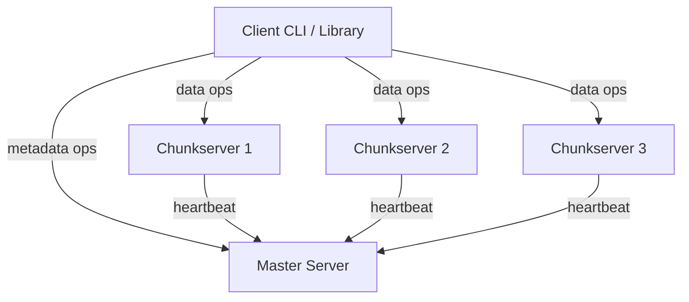
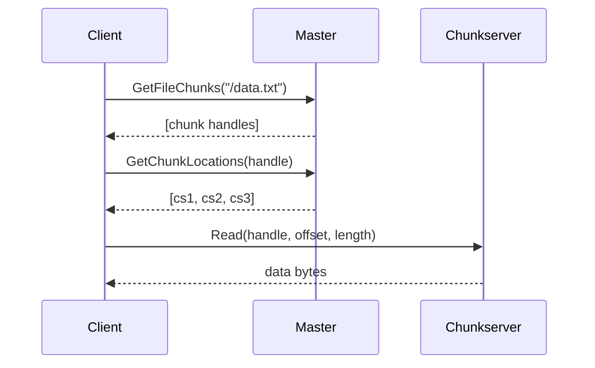
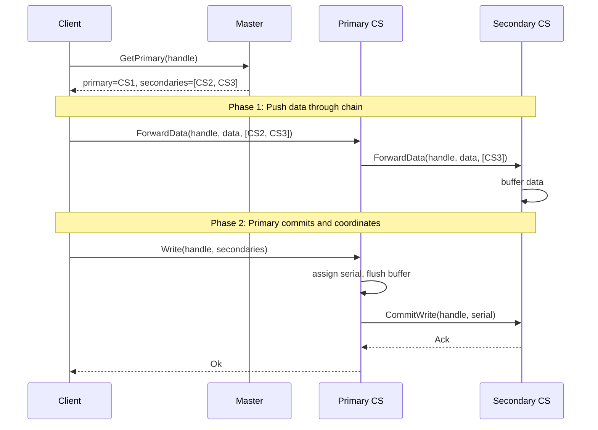
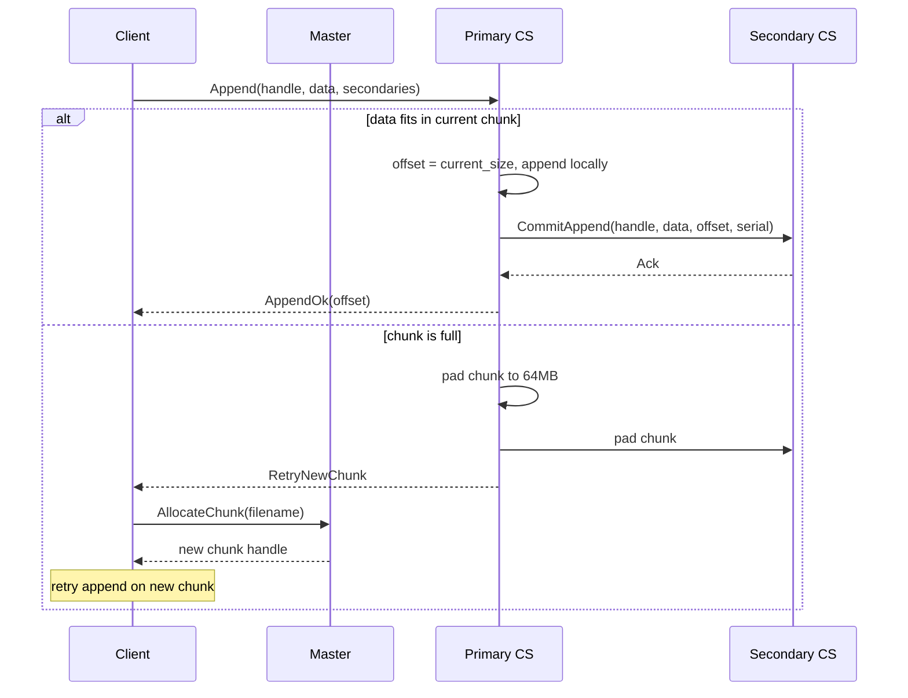

# juzfs

A distributed file system in Rust, based on the [Google File System paper](https://static.googleusercontent.com/media/research.google.com/en//archive/gfs-sosp2003.pdf). Built from scratch with raw TCP and bincode serialization, no gRPC.

For a detailed breakdown of the GFS architecture that this project follows, see [The Google File System: A Detailed Breakdown](https://www.pixperk.tech/blog/the-google-file-system-a-detailed-breakdown).

## Architecture

juzfs follows the classic GFS three-component design: a single master server for metadata, multiple chunkservers for data, and a client library that coordinates between them.




**Master** holds all metadata in memory: file namespace, file-to-chunk mappings, chunk locations, and lease state. It never touches file data. Chunkservers report their chunk inventory via heartbeats, so the master never persists chunk locations and can rebuild them on restart.

**Chunkservers** store chunks as plain files on disk, each chunk being 64MB by default (configurable). Every 64KB block within a chunk is checksummed with CRC32 for integrity verification. On startup, a chunkserver scans its data directory to recover existing chunks.

**Client** is a library that caches metadata (with a 30-second staleness window) and talks directly to chunkservers for reads and writes. The master is only contacted for metadata, keeping it off the data path entirely.

## How Reads Work

A read goes through two steps: ask the master where the data lives, then fetch it directly from a chunkserver.



The client picks the closest (or first available) replica. If one fails, it tries the next. For streaming reads, chunks are fetched sequentially and piped through a buffered channel (4 chunks ahead) so the consumer can process data as it arrives.

## How Writes Work

Writes use a two-phase protocol. Data flows through a pipeline of chunkservers first, then the primary coordinates the actual commit.




The primary assigns a monotonically increasing serial number to each mutation. This serial number is the global ordering that all replicas follow. Secondaries apply writes in serial order, which guarantees consistency across replicas.

### Leases

The master grants a 60-second lease to one chunkserver, making it the primary for a chunk. All writes for that chunk go through this primary during the lease period. If the lease expires, the master can grant a new one (possibly to a different chunkserver), bumping the chunk version number.

## Record Append

Record append is the bread and butter of GFS workloads. The client specifies only the data, and the primary picks the offset. This allows multiple clients to append concurrently to the same file without any external locking.




When the current chunk cannot fit the data, the primary pads it to the full chunk size on all replicas and tells the client to allocate a new chunk and retry. The padding ensures no replica has a partially filled chunk that could accept conflicting appends.

## Protocol

All communication uses a custom TCP framing protocol with length-prefixed messages:

```
[magic: 2B][version: 1B][msg_type: 1B][payload_len: 4B][payload: N bytes]
```

- Magic bytes: `0x4A 0x46` ("JF")
- Version: `0x01`
- Message types distinguish between client-master, client-chunkserver, and chunkserver-chunkserver traffic
- Payload is serialized with bincode v1

## Data Integrity

Each chunk on disk is stored as raw data followed by CRC32 checksums. Every 64KB block gets its own checksum. On read, the chunkserver recomputes the checksum and compares it against the stored value. A mismatch means corruption, and the read fails so the client can try another replica.

## Usage

Start the master and a few chunkservers, then use the CLI to interact.

```bash
# terminal 1: master
cargo run --bin master-server

# terminal 2: chunkserver
cargo run --bin chunkserver-node -- 127.0.0.1:6001 /tmp/cs1 127.0.0.1:5000

# terminal 3: another chunkserver
cargo run --bin chunkserver-node -- 127.0.0.1:6002 /tmp/cs2 127.0.0.1:5000

# terminal 4: another chunkserver
cargo run --bin chunkserver-node -- 127.0.0.1:6003 /tmp/cs3 127.0.0.1:5000
```

Then use the CLI:

```bash
# create a file (also allocates first chunk)
cargo run --bin juzfs -- create /hello.txt

# write data
cargo run --bin juzfs -- write /hello.txt 0 "the quick brown fox"

# read it back
cargo run --bin juzfs -- read /hello.txt

# read with offset and length
cargo run --bin juzfs -- read /hello.txt 4 5

# record append
cargo run --bin juzfs -- append /hello.txt "another line"

# streaming read
cargo run --bin juzfs -- stream /hello.txt
```

### CLI Options

```
juzfs [options] <command> [args]

options:
  --master <addr>        master address (default: 127.0.0.1:5000)
  --chunk-size <bytes>   chunk size in bytes (default: 64MB)

commands:
  create <path>              create file and allocate first chunk
  write  <path> <offset> <data>
  read   <path> [offset] [length]
  append <path> <data>       record append
  stream <path>              streaming read
```

## What is Implemented

- [x] Single master with in-memory metadata (file namespace, chunk mappings, leases)
- [x] Multiple chunkservers with disk persistence and CRC32 checksums
- [x] Custom TCP protocol with bincode serialization
- [x] Two-phase writes (push data through chain, then primary commits)
- [x] Serial mutation ordering via monotonic counters on the primary
- [x] Record append with automatic chunk overflow and retry
- [x] 60-second lease mechanism for write coordination
- [x] Chunkserver heartbeats with chunk location rebuild
- [x] Client metadata caching with 30-second staleness check
- [x] Streaming reads via buffered async channels
- [x] Chunkserver disk recovery on restart
- [x] CLI client

## What is Left

- [ ] Master operation log (oplog) for crash recovery
- [ ] Re-replication and rebalancing
- [ ] Garbage collection (lazy delete via heartbeat)
- [ ] Copy-on-write snapshots
- [ ] Chunk version numbers and stale replica detection

## References

- [The Google File System (2003)](https://static.googleusercontent.com/media/research.google.com/en//archive/gfs-sosp2003.pdf) - original paper by Ghemawat, Gobioff, and Leung
- [The Google File System: A Detailed Breakdown](https://www.pixperk.tech/blog/the-google-file-system-a-detailed-breakdown) - blog post this implementation follows
