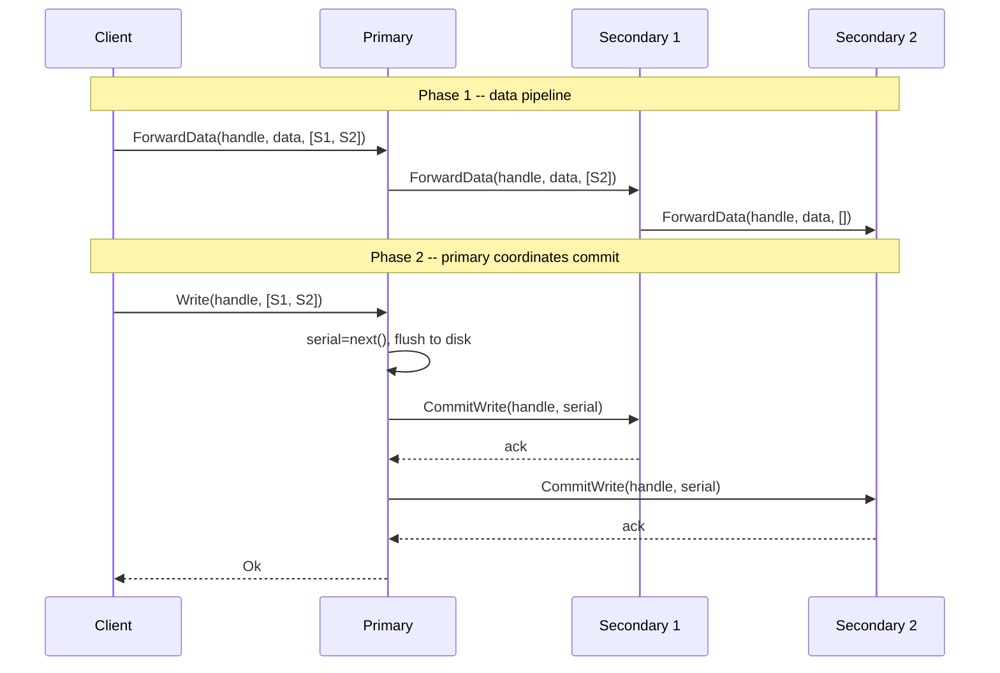

# juzfs

A distributed file system in Rust, based on the [Google File System paper](https://static.googleusercontent.com/media/research.google.com/en//archive/gfs-sosp2003.pdf). Built from scratch with raw TCP and bincode serialization. No gRPC, no protobuf.

For a detailed breakdown of the GFS architecture, see [The Google File System: A Detailed Breakdown](https://www.pixperk.tech/blog/the-google-file-system-a-detailed-breakdown).

## Why GFS

GFS was built around assumptions that most filesystems ignore: files are huge, reads are sequential, writes are almost always appends, and disks fail constantly. Rather than fighting these realities with a general-purpose POSIX layer, Google designed around them. One master, big chunks, relaxed consistency for appends. juzfs takes this same approach and implements it in Rust with async I/O.

## Architecture


Three components, all talking raw TCP:

### Master

The single metadata server. Holds the file namespace (filenames to chunk handle lists), chunk metadata (version, primary lease, replica locations), and the state of every registered chunkserver. Everything lives in memory behind `RwLock`s. The master never sees file data. Clients ask it "where does this chunk live?", get an answer, and go talk to chunkservers directly. Keeping the master off the data path is the core scalability trick in GFS.

Chunk locations are deliberately not persisted. On restart, the master knows nothing about which chunkserver holds what. As chunkservers boot and heartbeat in, they report their full chunk inventory with version numbers. The master rebuilds its location map from these reports. This is more robust than persisting locations because the chunkservers are always the ground truth about what's physically on their disks.

### Chunkservers

The data layer. Each chunkserver manages a local directory with three types of files per chunk:

```
chunks/00000001.chunk    -- raw data, up to 64MB
checksums/00000001.csum  -- CRC32 per 64KB block, packed big-endian
versions/00000001.ver    -- chunk version number
```

Chunks default to 64MB (configurable via CLI for testing). Every 64KB block gets a CRC32 checksum computed on write and verified on every read. A mismatch means corruption, and the read fails so the client can try another replica.

For writes, chunkservers maintain an LRU push buffer (32 entries). Data arrives in phase 1 of the write protocol and sits in memory until the primary triggers a commit in phase 2. A monotonic `AtomicU64` serial counter on the primary ensures all replicas apply mutations in identical order.

Every 5 seconds, each chunkserver heartbeats to the master with its chunk list (handles + versions) and real available disk space (calculated from actual file sizes, not hardcoded).

### Client

A Rust library (`src/client.rs`) that handles all the protocol complexity. It caches chunk metadata locally with a 30-second staleness window to avoid redundant master lookups. The client manages the full read, write, and append flows, including transparent retry when a chunk fills up during record append.

## Protocol

Custom TCP framing, length-prefixed:

```
[magic: 2B "JF"][version: 1B][msg_type: 1B][payload_len: 4B][payload]
```

Magic bytes `0x4A 0x46` catch misframed connections immediately. The `msg_type` byte routes messages:

| msg_type | Direction |
|----------|-----------|
| 1 | Client to Master |
| 2 | Master to Client |
| 3 | ChunkServer to Master |
| 4 | Master to ChunkServer |
| 5 | Client to ChunkServer |
| 6 | ChunkServer to Client |
| 7 | ChunkServer to ChunkServer |
| 8 | ChunkServer Ack |

Payloads are bincode v1. Each direction has its own serde enum, so extending the protocol is just adding a variant.

## Reads

The master is never on the read path. The client asks it for metadata once, then reads directly from chunkservers.

1. `GetFileChunks` returns the ordered list of chunk handles for a file
2. `GetChunkLocations` returns which chunkservers hold each chunk
3. Client sends `Read { handle, offset, length }` directly to a chunkserver
4. If that replica fails (network error, checksum mismatch), try the next one

For multi-chunk reads, the client calculates which chunks the byte range spans and issues per-chunk reads with the correct local offsets. If the requested length exceeds what the chunk actually has, the chunkserver clamps it and returns what's available.

**Streaming reads** pipe chunks through a tokio mpsc channel with a 4-chunk lookahead buffer. A background task fetches chunks in order and feeds them into the channel. The consumer processes data as it arrives without loading the entire file into memory.

## Writes

Writes separate data flow from control flow using a two-phase protocol. This is the most interesting part of the design.




**Phase 1** pushes data through a chunkserver chain. The client sends to the first node, which buffers and forwards to the next, and so on. Data flows in a single network pass rather than the client uploading to each replica separately. All nodes buffer in memory (the LRU push buffer), nothing touches disk yet.

**Phase 2** is where ordering happens. The client tells the primary to commit. The primary assigns a monotonic serial number, flushes its own buffer to disk, then sends `CommitWrite` to each secondary with that serial. Secondaries flush and ack. Only after all replicas confirm does the primary ack the client.

The serial number is the consistency mechanism. Two concurrent writes to the same chunk get serialized by the primary. Every replica applies them in serial order, so they converge to identical state.

### Leases

Before any write, the client asks the master for a primary via `GetPrimary`. The master grants a 60-second lease to one chunkserver. The same lease is reused for all writes during that window. No round-trip to the master per write, just per lease period.

When a lease expires and a new one is needed, the master bumps the chunk version, notifies all replicas via `UpdateVersion`, and returns the new primary. This version bump is how stale replicas get caught (more on that below).

## Record Append

The dominant write pattern in GFS. The client provides only data, no offset. The primary decides where to place it. Multiple clients can append concurrently to the same file without any coordination between them.


The flow:

1. Client finds the last chunk of the file and sends `Append { handle, data, secondaries }` to its primary
2. Primary checks: does `current_size + data_len` fit within the chunk size?
3. **Fits**: primary sets `offset = current_size`, appends locally, sends `CommitAppend` with the same offset and data to all secondaries. Returns `AppendOk { offset }` to the client.
4. **Doesn't fit**: primary pads the chunk to exactly 64MB on all replicas and returns `RetryNewChunk`. The client allocates a new chunk via the master, invalidates its metadata cache, and retries. This loop is transparent to the caller.

The padding matters. Without it, a half-full chunk on one replica could accept a conflicting append from a different client, breaking cross-replica consistency. Padding seals the chunk on all replicas simultaneously.

## Chunk Versioning

Every chunk starts at version 0. The version increments each time the master grants a new lease for that chunk. This is how the system detects replicas that missed mutations while they were down.

The version lives in three places:
- **Master memory**: `ChunkInfo.version`, the authoritative value
- **Chunkserver disk**: `.ver` file per chunk, survives restarts
- **Chunkserver memory**: `HashMap<ChunkHandle, u64>`, loaded from disk on init

When the master grants a lease and bumps the version, it connects to every replica and sends `UpdateVersion { handle, version }`. Each chunkserver persists the new version to its `.ver` file.

On heartbeat, each chunkserver reports `(handle, version)` pairs. The master compares:
- **Version matches or ahead**: healthy replica, stays in the location list
- **Version behind**: stale replica, removed from locations

Once removed, the stale chunkserver is invisible to clients. No reads or writes will be directed to it. This happens automatically, no manual intervention.

## Data Integrity


Every read goes through checksum verification:

1. Chunkserver reads the full chunk data from disk
2. Reads the stored CRC32 checksums (one per 64KB block)
3. Recomputes checksums from the data
4. Compares block by block

Any mismatch fails the read. The client then tries another replica. This catches silent disk corruption, partial writes, and bit rot without any external scrubbing process.

## Heartbeats

The heartbeat is the master's lifeline to the cluster. It serves three purposes:

1. **Liveness**: the master knows which chunkservers are up based on heartbeat timestamps
2. **Location rebuild**: chunk locations are reconstructed entirely from heartbeat reports, not persisted
3. **Stale detection**: version numbers in heartbeats let the master identify and exclude stale replicas

The cycle:
- On boot, a chunkserver sends `Register { addr, available_space }`
- Every 5 seconds after, it sends `Heartbeat { addr, chunks: Vec<(handle, version)>, available_space }`
- Available space is real: `capacity - sum(chunk file sizes on disk)`
- The master uses available space for placement decisions, preferring chunkservers with the most room

## Usage

Start the cluster in separate terminals:

```bash
# master
cargo run --bin master-server

# three chunkservers
cargo run --bin chunkserver-node -- 127.0.0.1:6001 /tmp/cs1 127.0.0.1:5000
cargo run --bin chunkserver-node -- 127.0.0.1:6002 /tmp/cs2 127.0.0.1:5000
cargo run --bin chunkserver-node -- 127.0.0.1:6003 /tmp/cs3 127.0.0.1:5000
```

Then use the CLI:

```bash
cargo run --bin juzfs -- create /hello.txt
cargo run --bin juzfs -- write /hello.txt 0 "the quick brown fox"
cargo run --bin juzfs -- read /hello.txt
cargo run --bin juzfs -- read /hello.txt 4 5
cargo run --bin juzfs -- append /hello.txt "another line"
cargo run --bin juzfs -- stream /hello.txt
```

### CLI

```
juzfs [options] <command> [args]

options:
  --master <addr>        master address (default: 127.0.0.1:5000)
  --chunk-size <bytes>   chunk size in bytes (default: 64MB)

commands:
  create <path>                create file and allocate first chunk
  write  <path> <offset> <data>
  read   <path> [offset] [length]
  append <path> <data>         record append
  stream <path>                streaming read
```

### Chunkserver

```
chunkserver-node <addr> <data_dir> <master_addr> [capacity_bytes]
```

`capacity_bytes` defaults to 1GB. Available space in heartbeats is `capacity - actual disk usage`.

### Logging

Structured logging via `tracing`. Control with `RUST_LOG`:

```bash
RUST_LOG=info cargo run --bin master-server    # default: file ops, leases, registrations
RUST_LOG=debug cargo run --bin master-server   # adds: heartbeats, cache behavior
```

## Implemented

- Single master, in-memory metadata (namespace, chunks, leases)
- Chunkservers with disk persistence, CRC32 checksums per 64KB block, version tracking
- Custom TCP protocol with magic bytes and bincode serialization
- Two-phase writes: pipelined data push, then primary-coordinated commit
- Mutation ordering via monotonic serial numbers on the primary
- Record append with chunk overflow detection, padding, and transparent retry
- 60-second write leases with version bump on renewal
- Stale replica detection via version comparison on heartbeat
- Master notifies replicas of version updates on lease grant
- Location rebuild from heartbeats (no persisted chunk locations)
- Available space tracking from real disk usage
- Client metadata caching (30s staleness window)
- Streaming reads with 4-chunk async buffer
- Chunkserver recovery on restart (scans chunks, checksums, versions)
- CLI client

## Remaining

- Master operation log (oplog) for crash recovery
- Re-replication for under-replicated chunks
- Chunk rebalancing across chunkservers
- Garbage collection (lazy delete, heartbeat-driven cleanup)
- Copy-on-write snapshots

## References

- [The Google File System (2003)](https://static.googleusercontent.com/media/research.google.com/en//archive/gfs-sosp2003.pdf) -- Ghemawat, Gobioff, and Leung
- [The Google File System: A Detailed Breakdown](https://www.pixperk.tech/blog/the-google-file-system-a-detailed-breakdown) -- blog this implementation follows
